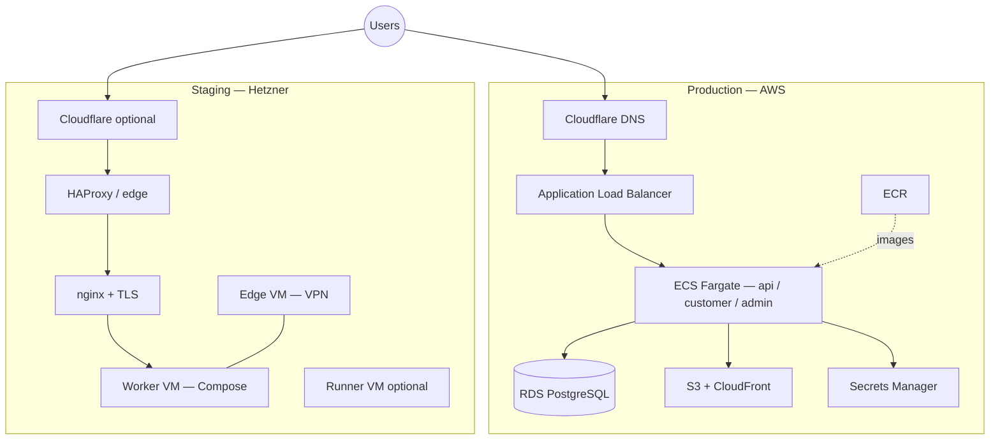

# AWS + Hetzner dual-environment deploy

Terraform and Ansible for running a **three-tier web product** in two places: **production on AWS** (managed containers, managed database, CDN) and **staging on Hetzner Cloud** (VMs, Docker Compose, edge load balancer, VPN). DNS and edge features can use **Cloudflare** for both zones.

Typical application shape this stack was built around:

- **API** — Go backend on **ECS Fargate** (prod) / Docker (staging)  
- **Customer app** — **Nuxt** (SSR) on Fargate (prod)  
- **Admin app** — **Nuxt** (static) on Fargate (prod)  
- **Database** — **PostgreSQL** (RDS in prod; Compose on staging)

---

## Architecture



---

## What’s in this repository

| Path | Purpose |
|------|---------|
| **`aws/`** | Full production stack as code |
| **`aws/bootstrap/`** | Optional one-off: S3 + DynamoDB for Terraform remote state |
| **`aws/modules/*`** | VPC, ECR, Secrets, S3/CloudFront, ACM, ALB, RDS, ECS, Budgets, Monitoring, GitHub OIDC |
| **`hetzner/terraform/`** | Hetzner Cloud: private network, firewalls, SSH key, VMs (worker, edge, optional GitHub runner) |
| **`hetzner/terraform/your-domain.org/`** | Example **Cloudflare** Terraform root: zone hardening, DNS A records, WAF-style rulesets (rename/copy for your staging domain) |
| **`hetzner/ansible/`** | nginx (TLS, reverse proxy, IP allow lists), HAProxy, OpenVPN, Docker, self-hosted runner roles |
| **`.github/workflows/develop.yml`** | CI: `terraform fmt/validate` + Ansible syntax (expects self-hosted runner labels you define) |

### AWS (`aws/`) — production components

- **VPC** — public + private subnets across two AZs; **NAT gateway off by default** (saves cost; enable in `vpc_network` if tasks need outbound internet from private subnets only).
- **ECR** — one repository per service (e.g. `api`, `customer`, `admin`); lifecycle policies for old images.
- **Secrets Manager** — app secrets; **database URL** secret built automatically from RDS.
- **S3 + CloudFront** — private bucket + OAI/OAC-style access for static uploads / asset CDN (optional via `enable_s3_cloudfront`).
- **ACM** — TLS certificate for `example.com` and `*.example.com`, validated through **Cloudflare DNS** (same provider as public DNS).
- **ALB** — HTTPS termination; routing: `/api/*` → API, host `admin.*` → admin service, default → customer.
- **RDS PostgreSQL** — in private subnets; security group allows only ECS.
- **ECS Fargate** — three services wired to ALB target groups; task roles for S3/SES as configured in the ECS module.
- **AWS Budgets** (optional) — monthly USD cap + email notifications (`cost_budget` in tfvars).
- **CloudWatch monitoring** (optional) — enable after first deploy when you know real resource names (`monitoring` block).

### Hetzner + Ansible — staging components

- **Terraform** provisions VMs, cloud network `10.0.1.0/24`, and separate **firewall** profiles (worker / LB / VPN).
- **Ansible** can install **nginx** (Let’s Encrypt, Cloudflare real-IP config), **HAProxy** TCP passthrough, **OpenVPN** for admin access to private IPs, **Docker**, and a **self-hosted GitHub Actions** runner.
- **Inventory** and **`group_vars`** hold IPs, domains, and HAProxy/nginx settings — align them with Terraform outputs after apply.

---

## Cost orientation (rough monthly)

Prices change by region, traffic, and spot/deals. Treat this as **order-of-magnitude planning**, not a quote.

| Area | Default-ish shape in this repo | Ballpark (USD, excl. tax) |
|------|--------------------------------|---------------------------|
| **Hetzner** | 3× `cx23`-class VMs + volumes as you add them | **~$15–35** (often cheaper than equivalent always-on AWS compute) |
| **AWS — compute** | Fargate: e.g. 512 + 256 + 256 CPU units, 1 task each | **~$15–50+** at light steady load (scales with CPU/memory and hours) |
| **AWS — RDS** | `db.t4g.micro`, 20 GB, single-AZ, backups | **~$15–30** |
| **AWS — ALB** | 1 ALB + LCU usage | **~$20–40+** depending on traffic |
| **AWS — other** | ECR storage, S3/CloudFront egress, Secrets Manager, CloudWatch logs | **~$5–30+** combined for small apps |
| **Cloudflare** | Free / Pro depending on plan | **$0–25** per zone |
| **NAT gateway** | **Disabled** in default VPC vars | **$0** here; enabling NAT adds **~$32+/month** per gateway + data |

**Ways this template keeps cost down:** no NAT by default, small Fargate sizes, single-AZ RDS option, staging entirely on Hetzner, optional S3 logging bucket only in prod in module logic, Budgets module to alert before bills surprise you.

---

## Prerequisites

- **Terraform** ≥ 1.5 (CI in this repo pins 1.9 for Hetzner checks).
- **AWS account** and credentials (CLI or environment variables).
- **Cloudflare** account with the **production** zone already on Cloudflare (for ACM validation and `CNAME` → ALB).
- **Cloudflare API token** with DNS edit on that zone (`CLOUDFLARE_API_TOKEN`).
- **Hetzner Cloud** project and API token for `hetzner/terraform`.
- **Ansible** + **ansible-vault** for staging secrets (`hetzner/ansible/group_vars/all/vault.yml` — not committed).
- **Docker images** pushed to **ECR** before ECS services can run healthy tasks (CI/CD or manual).

---

## Tutorial

### 1. Remote state for AWS (recommended)

Use `aws/bootstrap/` once per account/environment to create an S3 bucket and DynamoDB table for locks, **or** create them manually. Then add a root `backend.hcl` (not in git) similar to:

```hcl
bucket         = "your-terraform-state-bucket"
key            = "myapp/prod/terraform.tfstate"
region         = "eu-central-1"
dynamodb_table = "terraform-locks"
encrypt        = true
```

Edit `aws/bootstrap/main.tf` bucket naming if you forked the project (it may still say a sample project name).

### 2. Configure and apply **production** (`aws/`)

1. Copy `.gitignore` rules: keep **`terraform.tfvars`** and **`backend.hcl`** local only.
2. Create `aws/terraform.tfvars` defining at minimum:
   - `environment`, `project_name`, `aws_region`, `domain_name` (must match Cloudflare zone)
   - `ecr_repositories`, `secrets` (keys expected by `main.tf` / ECS module — adjust code if you rename secrets)
   - `rds_config` (including `db_password`)
   - `ecs_services` sizes and `api_env`
   - Optional: `cost_budget`, `monitoring`, `enable_s3_cloudfront`, `s3_bucket_name`
3. Export `CLOUDFLARE_API_TOKEN`.
4. Run:

```bash
cd aws
terraform init -backend-config=backend.hcl
terraform plan
terraform apply
```

5. After apply: confirm **ACM** issued, **Cloudflare** records point to ALB, and **ECR** has images; then ECS services should stabilize.

### 3. **Hetzner** staging (`hetzner/terraform/`)

1. Create `terraform.tfvars` with `hcloud_token = "..."` (and configure backend if you use S3 remote state for Hetzner — this repo’s `main.tf` references an S3 backend block).
2. Edit `data/config.yaml`: cluster name, SSH public key, node sizes/locations.
3. `terraform init` / `plan` / `apply`.
4. Note outputs (public/private IPs) for Ansible inventory.

### 4. **Ansible** (`hetzner/ansible/`)

1. Copy or create `group_vars/all/vault.yml` and encrypt with `ansible-vault`.
2. Update `inventory/hosts.yaml` and `group_vars/*.yml` (domains, IPs, `nginx_trusted_cidrs` or role defaults, HAProxy passwords).
3. Uncomment/adjust plays in `site.yml` (nginx, docker, openvpn, runner) to match what you want on staging.
4. Run against the right limit, e.g. `ansible-playbook site.yml --limit test-env`.

### 5. **Staging Cloudflare** (optional)

Under `hetzner/terraform/your-domain.org/` (rename the folder to match your staging zone):

1. Create `terraform.tfvars` with `cloudflare_account_id` and `zone_name` (see `variables.tf` defaults you may override).
2. Set `locals.app_ip` (or equivalent) to your **worker** public IP for root/admin `A` records.
3. `terraform apply` in that directory.

### 6. CI/CD

- **GitHub Actions**: production pipelines usually need **ECR push** + **ECS service update** (OIDC to AWS is supported via `aws/modules/github-oidc` when wired in). This repo’s `develop.yml` runs **Terraform validate** and **Ansible syntax-check** on **`ubuntu-latest`**; switch to self-hosted runners if you need private network access during CI.

---

## Security notes

- Never commit **`terraform.tfvars`**, **`backend.hcl`**, **`vault.yml`**, or **`.tfstate`**.
- Restrict **Cloudflare** and **Hetzner** tokens; rotate on leak.
- **nginx** allow lists and **Cloudflare** rulesets reduce exposure of staging admin surfaces.
- After sharing drafts publicly, **rotate** any secret that ever appeared in chat or old commits.

---

## License

Use as a starting point for your own infrastructure. No warranty; adapt modules and variables to your product and compliance needs.
